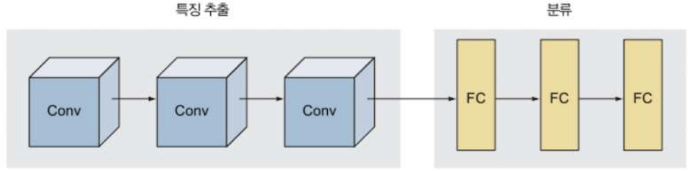

# DeepLearning-for-VisionSystems

`비전 시스템을 위한 딥러닝` 책에서 공부한 전통적인 컴퓨터 비전 모델을 구현합니다.

각 모델이 처음 소개된 논문과 해당 도서를 참고하여 최대한 논문에 가깝게 구현하는 것을 목표로 합니다.


### CNN의 디자인 패턴
    1. 첫 번째 패턴 - 특징 추출과 분류: CNN은 트게 특징추출(Conv)&분류(FC)로 구분할 수 있음, 
        
        
        
    2. 두 번째 패턴 - 이미지 깊이는 증가, 크기는 감소: 모든 층 입력은 전 층의 결과 이미지임
        - 이때 이미지란 높이, 폭, 깊이가 있는 3차원 대상으로 일반화해서 생각할 수 있음
    3. 세 번째 패턴 - 전결합층: 층이 지날 수록 유닛 수는 유지 혹은 줄어들게 됨

### LeNet-5(1998)
    1. LeNet 구조: 3개의 Conv층과 2개의 FC층으로 구성, 활성화함수는 tanh, 분류는 softmax
        
        
        
    - 2. pytorch로 LeNet-5 구현하기
        
        ```python
        # LeNet5 모델 정의
        class LeNet5(nn.Module):
        
            def __init__(self, num_classes):
                super(LeNet5, self).__init__()
                self.conv1 = nn.Conv2d(in_channels=1, out_channels=6, kernel_size=5, stride=1)
                self.pool2 = nn.AvgPool2d(kernel_size=2, stride=2)
                self.conv3 = nn.Conv2d(in_channels=6, out_channels=16, kernel_size=5, stride=1)
                self.pool4 = nn.AvgPool2d(kernel_size=2, stride=2)
                self.conv5 = nn.Conv2d(in_channels=16, out_channels=120, kernel_size=5, stride=1)
                self.fc6 = nn.Linear(120, 84)
                self.fc7 = nn.Linear(84, num_classes)
        
            def forward(self, x):
                x = self.conv1(x)
                x = F.tanh(x)
        
                x = self.pool2(x)
        
                x = self.conv3(x)
                x = F.tanh(x)
        
                x = self.pool4(x)
        
                x = self.conv5(x)
                x = F.tanh(x)
        
                x = x.view(x.size(0), -1)
                x = self.fc6(x)
                x = F.tanh(x)
        
                logits = self.fc7(x)
                
                return logits
        ```
        
        
        
        [](https://github.com/minseok128/CV_Sys_DL/tree/main/LeNet-5)
        
    1. 하이퍼파라미터 설정하기
        - 특이한 점은 학습률이 미리 설정된 스케줄링에 맞추어 구현된다는 것!
    2. MNIST 데이터셋에 대한 LeNet의 성능
        - 다음과 같은 결과를 확인할 수 있음
            
            
            

### AlexNet(2012)
    - 1,000가지 이상의 클래스로 구성된 120만장의 이미지넷 데이터셋을 학습하고 구분,
    65만개의 뉴런과 6천만 개의 학습 파라미터가 존재 → LeNet5에 비해 매우 복잡한 특징 학습 가능
    1. AlexNet 구조
        - 합성곱층의 필터 크기: 11x11, 5x5, 3x3으로 다양함
        - MaxPooling 사용
        - 과적합 방지를 위한 드롭아웃 기법 적용
        - 은닉층의 활성화 함수는 ReLU, 출력층은 softmax 사용
        - 총 8개의 층으로, Conv 층 5개와 FC 층 3개로 구성되어있음
            
            
            
    2. AlexNet에서 발전된 부분
        - ReLU를 활성화 함수로 사용: 시그모이드 계열 활성화 함수에서 큰 값에 대해 함수 값이 크게 변하지 않는 기울기 소실 문제를 해결
            
            
            
        - 드롭아웃층: 과적합을 방지, 순전파와 역전파 모두에서 특정 뉴런을 배제하여 학습 → 뉴런 간 상호 적응을 방지, AlexNet은 2개의 FC 층에 0.5 드롭아웃을 적용
        - 데이터 강화: 원 데이터만 변형하는 방식으로 데이터 양을 늘려 과적합 방지
        - 국소 응답 정규화: 가중치를 빠르게 수렴시키기 위함, 현재는 배치 정규화를 주로 사용함
        - 가중치 규제화: 0.00005의 L2 규제화로 과적합 억제 및 일반화 성능 향상
            
            ```python
            # Use Adam optimizer with weight_decay for L2 regularization
            optimizer=optim.Adam(model.parameters(), lr=0.001, weight_decay=0.01)
            ```
            
        - 다중 GPU 사용: 당시 GPU의 한계를 극복하기 위해 신경망을 2개의 GPU에 나눠 담고 서로 통신하도록 설계 → 요즘은 분산 GPU 환경에 대한 기법이 발전해있기에 이런 자세한 구현은 요구되지 않음
    - 3. Pytorch로 AlexNet 구현하기
        
        ```python
        # AlexNet 실제로 2개의 GPU가 지원되는 경우에 2개의 GPU를 사용하는 방식으로 구현 (multi-GPU 구현)
        class AlexNet(nn.Module):
            def __init__(self):
                super(AlexNet, self).__init__()
                self.lrn_a = nn.LocalResponseNorm(LRN_N, alpha=LRN_ALPHA, beta=LRN_BETA, k=LRN_K).to('cuda:0')
                self.lrn_b = nn.LocalResponseNorm(LRN_N, alpha=LRN_ALPHA, beta=LRN_BETA, k=LRN_K).to('cuda:1')
                self.dropout_a = nn.Dropout(DROPOUT).to('cuda:0')
                self.dropout_b = nn.Dropout(DROPOUT).to('cuda:1')
                self.pool_a = nn.MaxPool2d(kernel_size=3, stride=2).to('cuda:0')
                self.pool_b = nn.MaxPool2d(kernel_size=3, stride=2).to('cuda:1')
        
                # Conv 1
                self.conv1_a = nn.Conv2d(3, 48, kernel_size=11, stride=4, padding=0).to('cuda:0')
                self.conv1_b = nn.Conv2d(3, 48, kernel_size=11, stride=4, padding=0).to('cuda:1')
        
                # Conv 2
                self.conv2_a = nn.Conv2d(48, 128, kernel_size=5, stride=1, padding=2).to('cuda:0')
                self.conv2_b = nn.Conv2d(48, 128, kernel_size=5, stride=1, padding=2).to('cuda:1')
        
                # Conv 3
                self.conv3_a = nn.Conv2d(128 * 2, 192, kernel_size=3, stride=1, padding=1).to('cuda:0')
                self.conv3_b = nn.Conv2d(128 * 2, 192, kernel_size=3, stride=1, padding=1).to('cuda:1')
        
                # Conv 4
                self.conv4_a = nn.Conv2d(192, 192, kernel_size=3, stride=1, padding=1).to('cuda:0')
                self.conv4_b = nn.Conv2d(192, 192, kernel_size=3, stride=1, padding=1).to('cuda:1')
        
                # Conv 5
                self.conv5_a = nn.Conv2d(192, 128, kernel_size=3, stride=1, padding=1).to('cuda:0')
                self.conv5_b = nn.Conv2d(192, 128, kernel_size=3, stride=1, padding=1).to('cuda:1')
        
                # FC 6
                self.fc6_a = nn.Linear(128 * 6 * 6 * 2, 2048).to('cuda:0')
                self.fc6_b = nn.Linear(128 * 6 * 6 * 2, 2048).to('cuda:1')
        
                # FC 7
                self.fc7_a = nn.Linear(2048 * 2, 2048).to('cuda:0')
                self.fc7_b = nn.Linear(2048 * 2, 2048).to('cuda:1')
        
                # FC 8
                self.fc8 = nn.Linear(2048 * 2, NUM_CLASSES).to('cuda:0')
        
            def forward(self, x):
                stream0 = torch.cuda.Stream('cuda:0')
                stream1 = torch.cuda.Stream('cuda:1')
        
                with torch.cuda.stream(stream0):
                    x_a = x.to('cuda:0')
                    # Conv 1
                    x_a = self.lrn_a(F.relu(self.conv1_a(x_a)))
                    x_a = self.pool_a(x_a)
                    # Conv 2
                    x_a = self.lrn_a(F.relu(self.conv2_a(x_a)))
                    x_a = self.pool_a(x_a)
                with torch.cuda.stream(stream1):
                    x_b = x.to('cuda:1')
                    # Conv 1
                    x_b = self.lrn_b(F.relu(self.conv1_b(x_b)))
                    x_b = self.pool_b(x_b)
                    # Conv 2
                    x_b = self.lrn_b(F.relu(self.conv2_b(x_b)))
                    x_b = self.pool_b(x_b)
        
                # GPU 통신
                stream0.synchronize()
                stream1.synchronize()
                x_b_ = x_b.to('cuda:0')
                x_a_ = x_a.to('cuda:1')
        
                with torch.cuda.stream(stream0):
                    # Conv 3
                    x_a = torch.cat((x_a, x_b_), dim=1)
                    x_a = F.relu(self.conv3_a(x_a))
                    # Conv 4
                    x_a = F.relu(self.conv4_a(x_a))
                    # Conv 5
                    x_a = F.relu(self.conv5_a(x_a))
                    x_a = self.pool_a(x_a)
                    x_a = x_a.view(x_a.size(0), -1)
                with torch.cuda.stream(stream1):
                    # Conv 3
                    x_b = torch.cat((x_a_, x_b), dim=1)
                    x_b = F.relu(self.conv3_b(x_b))
                    # Conv 4
                    x_b = F.relu(self.conv4_b(x_b))
                    # Conv 5
                    x_b = F.relu(self.conv5_b(x_b))
                    x_b = self.pool_b(x_b)
                    x_b = x_b.view(x_b.size(0), -1)
        
                # GPU 통신
                stream0.synchronize()
                stream1.synchronize()
                x_b_ = x_b.to('cuda:0')
                x_a_ = x_a.to('cuda:1')
        
                with torch.cuda.stream(stream0):
                    # FC 6, GPU 데이터 합치고 각각 연산 수행
                    x_a = torch.cat((x_a, x_b_), dim=1)
                    x_a = self.dropout_a(F.relu(self.fc6_a(x_a)))
                with torch.cuda.stream(stream1):
                    # FC 6, GPU 데이터 합치고 각각 연산 수행
                    x_b = torch.cat((x_a_, x_b), dim=1)
                    x_b = self.dropout_b(F.relu(self.fc6_b(x_b)))
        
                # GPU 통신
                stream0.synchronize()
                stream1.synchronize()
                x_b_ = x_b.to('cuda:0')
                x_a_ = x_a.to('cuda:1')
        
                with torch.cuda.stream(stream0):
                    # FC 7, GPU 데이터 합치고 각각 연산 수행
                    x_a = torch.cat((x_a, x_b_), dim=1)
                    x_a = self.dropout_a(F.relu(self.fc7_a(x_a)))
                with torch.cuda.stream(stream1):
                    # FC 7, GPU 데이터 합치고 각각 연산 수행
                    x_b = torch.cat((x_a_, x_b), dim=1)
                    x_b = self.dropout_b(F.relu(self.fc7_b(x_b)))
        
                stream0.synchronize()
                stream1.synchronize()
                # FC 8, GPU 데이터 합쳐서 최종 연산
                x_b_ = x_b.to('cuda:0')
                x = torch.cat((x_a, x_b_), dim=1)
                logits = self.fc8(x)
        
                return logits
        ```
        
    1. 하이퍼파라미터 설정하기: 당시 GTX580 2대로 90에포크를 6일간 학습하였음, 학습률을 0.01로, 모멘텀은 0.9로 검증오차가 개선되지 않으면 학습률을 0.1배로 조정함
    2. AlexNet의 성능: 15.3%의 top-5 오차율 기록
        - top-1 오차율은 정답 클래스에 가장 높은 확률을 부여하지 않은 비율, top-5 오차율은 정답이 상위 예측 클래스 5개에 포함되지 않는 비율, 이는 정답에 얼마나 근사한지 나타냄

### VGGNet(2014)
    - 구성 요소들은 기존과 동일하지만, 신경망의 층수 자체를 늘리는 방법을 선택
    - VGG16의 경우 13개의 합성곱층과 3개의 FC층으로 구성, 모든 층 하이퍼파라미터 동일 이해 쉬움
    - 핵심 질문 2가지!
        1. 어떻게 AlexNet의 2배 깊이인 16층 모델에 대한 학습을 성공했을까?!
            - → 3x3의 단순한 필터 덕분
        2. 왜 모든 Conv 층에서 3x3 필터만을 사용했을까?
            - → 3x3필터를 여러번 쌓으면 더 큰 필터의 효과를 볼 수 있기 때문
            - → 여러번 활성함수를 사용할 수 있어서 결정 함수의 비선형성이 증가, 학습 파라미터도 감소
                
                
                
                
                
                
    1. VGGNet에서 발전된 부분
        - 모든 Conv층과 FC층이 동일한 하이퍼파라미터(커널 크기, stride)로 단순화된 구조
            - 모든 Conv층은 3x3 크기의 필터와 stride 1, 패딩 1이 적용
            - 모든 풀링층은 2x2 크기의 풀링영역과 stride 2적용
        - 커널의 크기가 작은 것을 여러겹 쌓는 것이 세밀한 특징을 추출하는데 유리하고 파라미터 수도 적어서 낮은 비용으로 복잡한 특징 학습 가능
            
            
            
            
            
    2. VGGNet의 다양한 버전: VGGNet은 세부 사항이 다른 여러 버전으로 나뉨
        - 이 중 D(VGGNet16, 파라미터 약 1억 3,800만)와 E(VGGNet19, 파라미터 약 1억 4,400만)가 가장 유명함
            
            
            
    - 3.  Pytorch로 VGGNet16 구현하기
        
        ```python
        # VGGNet16 모델의 Block 정의
        class VGGNet16Block(nn.Module):
            def __init__(self, in_channels, out_channels, num_convs):
                super(VGGNet16Block, self).__init__()
                self.convs = nn.ModuleList(
                    [
                        nn.Conv2d(
                            in_channels if i == 0 else out_channels,
                            out_channels,
                            kernel_size=3,
                            padding=1,
                        )
                        for i in range(num_convs)
                    ]
                )
                self.batchnorm = nn.BatchNorm2d(out_channels)
                self.pool = nn.MaxPool2d(kernel_size=2, stride=2)
        
            def forward(self, x):
                for conv in self.convs:
                    x = F.relu(conv(x))
                x = self.batchnorm(x)
                x = self.pool(x)
                return x
        
        # VGGNet16 모델 정의
        class VGGNet16(nn.Module):
            def __init__(self):
                super(VGGNet16, self).__init__()
                self.dropout = nn.Dropout(DROPOUT)
        
                self.block1 = VGGNet16Block(3, 64, num_convs=2)
                self.block2 = VGGNet16Block(64, 128, num_convs=2)
                self.block3 = VGGNet16Block(128, 256, num_convs=3)
                self.block4 = VGGNet16Block(256, 512, num_convs=3)
                self.block5 = VGGNet16Block(512, 512, num_convs=3)
        
                self.fc14 = nn.Linear(512 * 7 * 7, 4096)
                self.fc15 = nn.Linear(4096, 4096)
                self.fc16 = nn.Linear(4096, NUM_CLASSES)
        
            def forward(self, x):
                x = self.block1(x)
                x = self.block2(x)
                x = self.block3(x)
                x = self.block4(x)
                x = self.block5(x)
        
                x = x.view(-1, 512 * 7 * 7)
                x = F.relu(self.fc14(x))
                x = self.dropout(x)
                x = F.relu(self.fc15(x))
                x = self.dropout(x)
                logits = self.fc16(x)
        
                return logits
        
        torchinfo.summary(
            VGGNet16(),
            input_size=(1, 3, IMG_SIZE, IMG_SIZE),
            col_names=["input_size", "output_size", "num_params", "kernel_size"],
            row_settings=["depth", "var_names"],
        )
        ```
        
    1. 하이퍼파라미터 설정하기: 학습과정 자체는 AlexNet을 참고했음, 미니배치 경사하강법 적용
    2. VGGNet의 성능: AlexNet보다 개선되었으며 층이 깊고 파라미터 수가 많음에도 필터의 크기 및 규제화 덕분에 수렴은 더욱 빠르게 됨

### GoogLeNet(2014)
    - 신경망 내부적으로 계산 자원의 효율을 높여 층수를 늘릴 수 있게됨, 인셉션 모듈 구조 기반, 22개 층이 있지만 학습 파라미터의 수는 VGGNet의 1/12에 불과함
    1. 인셉션 구조에서 발전된 부분
        - 기존 모델에서는 합성곱 커널의 크기와 풀링층의 위치를 실행을 통해 최적으로 결정해야하는 문제가 있었음 → 서로 다른 합성곱층으로 구성된 인셉션 모듈을 만들고 이를 쌓아서 신경망 전체를 구성
            
            
            
            - 기존과 달리 인셉션 모듈을 이용하여 전체를 구성, 모듈 내부는 블랙박스로 취급
        1. 단순 인셉션 모듈: 단순하게 인셉션 모듈은 넓이가 4인 구조로 이루어짐
            - 각 합성곱층은 다른 크기의 필터를 갖고있지만 결과 특징맵의 가로 세로 크기는 동일
            4개의 결과를 합친 것이 output → 어떤 커널 사이즈를 선택할지 고민 x
                
                
                
                - 문제는 이 과정에서 너무 과한 계산 복잡도가 요구된 다는 것
        2. 차원 축소가 적용된 인셉션 모듈: 5x5 합성곱은 너무 많은 계산량을 요구함 → 차원 축소로 해결
            - 차원 축소충(reduce layer, 1x1 conv): 이를 통해 입력 가로 세로 크기는 유지하면서 원하는 만큼 깊이는 줄일 수 있음
                
                
                
                
                
                
                - 기존 1억 6300번 요구되던 연산이 1,630만 회로 줄었음
            - 차원 축소가 신경망 성능에 미치는 영향: 논문에서는 적정한 수준을 유지하는 한 신경망 전체 성능에 큰 영향을 주지 않는 다는 것을 알게 됨
            - 차원 축소가 적용된 인셉션 모듈: 각 conv에 차원 축소를 사전 적용, 풀링 후에도 차원 축소 적용
                
                
                
                - 계산 복잡도의 급상승을 억제할 수 있음 → 더 깊은 층을 구성할 수 있음
        3. 인셉션 구조: 인셉션 모듈과 모듈 사이에 3x3 max pooling 적용해서 모듈을 쌓아올릴 수 있음
            - 초반 구조는 기존 모델과 유사하게 구성, 이후 인셉션 모듈을 총 9번 반복, 이후 분류기로 구성됨
                
                
                
        - 5. Pytorch로 구현한 GoogleNet
            - 논문에서는 다음의 표에 맞추어 구현함
                
                
                
            
            ```python
            class BasicConv2d(nn.Module):
                def __init__(self, in_channels, out_channels, **kwargs):
                    super(BasicConv2d, self).__init__()
                    self.conv = nn.Conv2d(in_channels, out_channels, **kwargs)
                    self.bn = nn.BatchNorm2d(out_channels)
            
                def forward(self, x):
                    return self.bn(self.conv(x))
            
            # Inception 모듈 정의
            class InceptionModule(nn.Module):
                def __init__(
                    self, in_dim, out_dim1, pre_dim3, out_dim3, pre_dim5, out_dim5, out_dim_pool
                ):
                    super(InceptionModule, self).__init__()
                    # branch 1x1
                    self.conv1x1 = BasicConv2d(in_dim, out_dim1, kernel_size=1)
                    # branch 3x3
                    self.conv3x3_pre = BasicConv2d(in_dim, pre_dim3, kernel_size=1)
                    self.conv3x3 = BasicConv2d(pre_dim3, out_dim3, kernel_size=3, padding=1)
                    # branch 5x5
                    self.conv5x5_pre = BasicConv2d(in_dim, pre_dim5, kernel_size=1)
                    self.conv5x5 = BasicConv2d(pre_dim5, out_dim5, kernel_size=5, padding=2)
                    # branch pooling
                    self.pool = nn.MaxPool2d(kernel_size=3, stride=1, padding=1)
                    self.pool_after = BasicConv2d(in_dim, out_dim_pool, kernel_size=1)
            
                def forward(self, x):
                    out1x1 = F.relu(self.conv1x1(x))
                    out3x3 = F.relu(self.conv3x3(F.relu(self.conv3x3_pre(x))))
                    out5x5 = F.relu(self.conv5x5(F.relu(self.conv5x5_pre(x))))
                    out_pool = F.relu(self.pool_after(self.pool(x)))
                    return torch.cat([out1x1, out3x3, out5x5, out_pool], 1)
            
            # GoogLeNet 모델 파트 A 정의
            class GoogLeNetPartA(nn.Module):
                def __init__(self):
                    super(GoogLeNetPartA, self).__init__()
                    self.pool = nn.MaxPool2d(kernel_size=3, stride=2, padding=1)
                    self.conv1 = BasicConv2d(3, 64, kernel_size=7, stride=2, padding=3)
                    self.conv2 = BasicConv2d(64, 64, kernel_size=1)
                    self.conv3 = BasicConv2d(64, 192, kernel_size=3, padding=1)
            
                def forward(self, x):
                    x = F.relu(self.conv1(x))
                    x = self.pool(x)
                    x = F.relu(self.conv2(x))
                    x = F.relu(self.conv3(x))
                    x = self.pool(x)
                    return x
            
            # GoogLeNet 모델 파트 B 정의
            class GoogLeNetPartB(nn.Module):
                def __init__(self):
                    super(GoogLeNetPartB, self).__init__()
                    self.pool = nn.MaxPool2d(kernel_size=3, stride=2, padding=1)
                    self.inception3a = InceptionModule(192, 64, 96, 128, 16, 32, 32)
                    self.inception3b = InceptionModule(256, 128, 128, 192, 32, 96, 64)
                    self.inception4a = InceptionModule(480, 192, 96, 208, 16, 48, 64)
                    self.inception4b = InceptionModule(512, 160, 112, 224, 24, 64, 64)
                    self.inception4c = InceptionModule(512, 128, 128, 256, 24, 64, 64)
                    self.inception4d = InceptionModule(512, 112, 144, 288, 32, 64, 64)
                    self.inception4e = InceptionModule(528, 256, 160, 320, 32, 128, 128)
                    self.inception5a = InceptionModule(832, 256, 160, 320, 32, 128, 128)
                    self.inception5b = InceptionModule(832, 384, 192, 384, 48, 128, 128)
            
                def forward(self, x):
                    x = self.inception3a(x)
                    x = self.inception3b(x)
                    x = self.pool(x)
                    x = self.inception4a(x)
                    x = self.inception4b(x)
                    x = self.inception4c(x)
                    x = self.inception4d(x)
                    x = self.inception4e(x)
                    x = self.pool(x)
                    x = self.inception5a(x)
                    x = self.inception5b(x)
                    return x
            
            # GoogLeNet 모델 파트 C 정의
            class GoogLeNetPartC(nn.Module):
                def __init__(self):
                    super(GoogLeNetPartC, self).__init__()
                    self.avgpool = nn.AvgPool2d(kernel_size=7, stride=1)
                    self.dropout = nn.Dropout(DROPOUT)
                    self.fc = nn.Linear(1024, NUM_CLASSES)
            
                def forward(self, x):
                    x = self.avgpool(x)
                    x = x.view(x.size(0), -1)
                    x = self.dropout(x)
                    x = self.fc(x)
                    return x
            
            # GoogLeNet 모델 정의
            class GoogLeNet(nn.Module):
                def __init__(self):
                    super(GoogLeNet, self).__init__()
                    self.part1 = GoogLeNetPartA()
                    self.part2 = GoogLeNetPartB()
                    self.part3 = GoogLeNetPartC()
            
                def forward(self, x):
                    x = self.part1(x)
                    x = self.part2(x)
                    x = self.part3(x)
                    return x
            
            torchinfo.summary(
                GoogLeNet(),
                input_size=(1, 3, IMG_SIZE, IMG_SIZE),
                col_names=["input_size", "output_size", "num_params", "kernel_size"],
                row_settings=["depth", "var_names"],
            )
            ```
            
        1. 하이퍼파라미터 설정하기: 8에폭마다 학습률 4% 감소
        2. CIFAR 데이터셋을 대상으로 한 인셉션의 성능: 기존 모델에 비해 훨씬 뛰어나고 사람에 필적하는 성능을 보임
    
### ResNet(2015)
    - MS 팀에서 residual neural network 개념 제시 → residual module과 skip connection 구조를 사용하여 은닉층에 강한 배치 정규화 적용 → 훨씬 깊은 층을 신경망 복잡도를 낮추며 구현 가능
    1. ResNet에서 발전된 부분
        - 문제상황: 신경망의 깊은 층은 더욱 복잡한 패턴을 학습 가능하게 함 → 그러나 층이 깊으면 과적합 발생이 쉬움 → 이를 드롭아웃, 규제화, 배치 정규화로 해결하고자 함 → 그러나 근본적으로 기울기 소실 문제를 해결할 필요가 있음
        - gradient vanishing: 역전파 과정에서 앞쪽에 위치한 층의 가중치 수정을 위한 신호가 매우 작아져서 모델이 개선되지 않는 것
            - 오차함수의 기울기가 이전으로 전달 될 때 가중치 행렬이 곱해지면서 기울기 값이 지수적으로 감소하기 때문
        - skip connection: gradient vanishing을 해결하기 위해 제시됨
            - 앞쪽 층에 뒤쪽 층의 기울기가 직접 전달되거나, 앞쪽 층의 정보가 뒤쪽으로 전달되기도 함
            - 모델이 항등함수를 학습할 수 있어 앞쪽 층보다 성능이 하락하지 않도록 함
            - 기존 입력이 Conv 출력과 더해지고(차원 동일), 함께 활성화 함수를 통과함
                
                
                
                ```python
                class ResidualBlock(nn.Module):
                    def __init__(self, in_channels, out_channels):
                        super(ResidualBlock, self).__init__()
                        self.conv1 = nn.Conv2d(in_channels, out_channels, kernel_size=3, stride=1, padding=1)
                        self.conv2 = nn.Conv2d(out_channels, out_channels, kernel_size=3, stride=1, padding=1)
                
                    def forward(self, x):
                        x_shortcut = x
                        x = F.relu(self.conv1(x))
                        x = self.relu(self.conv2(x) + x_shortcut)
                        return x
                ```
                
            - Residual Block이 인셉션 모듈처럼 반복적으로 등장하는 형태가 전체 모습
                
                
                
    2. residual block: 기본적으로 2가지 경로(지름길 경로, 주 경로)로 나뉘고 합쳐짐
        - bottleneck residual block 기본적 특징
            - 블록 내에는 풀링층이 존재하지 않음 → 인셉션과 유사하게 1x1 합성곱과 3x3, 1x1을 차례로 수행하면서  각 1x1에서 차원 축소 수행
            - 처음 1x1 conv의 stride 크기에 따라서 output의 가로세로 차원 축소 여부를 결정 가능
        - bottleneck residual block의 2가지 타입
            - reduce shortcut이 없는 경우 → output의 차원이 달라지지 않음
                
                
                
            - reduce shortcut이 존재하는 경우 → output의 차원이
                
                
                
    - 3. Pytorch로 ResNet50 구현하기
        - 참고 자료
            
            
            
            
            
        - code
            
            ```jsx
            class BottleneckResidualBlock(nn.Module):
                def __init__(self, in_channels, out_channels, stride, downsample=False):
                    super(BottleneckResidualBlock, self).__init__()
                    o1, o2, o3 = out_channels
                    self.conv1 = nn.Conv2d(
                        in_channels, o1, kernel_size=1, stride=stride, bias=False
                    )
                    self.bn1 = nn.BatchNorm2d(o1)
                    self.conv2 = nn.Conv2d(o1, o2, kernel_size=3, stride=1, padding=1, bias=False)
                    self.bn2 = nn.BatchNorm2d(o2)
                    self.conv3 = nn.Conv2d(o2, o3, kernel_size=1, stride=1, bias=False)
                    self.bn3 = nn.BatchNorm2d(o3)
            
                    if downsample:
                        self.downsample = nn.Conv2d(in_channels, o3, kernel_size=1, stride=stride, bias=False)
                        self.bn_downsample = nn.BatchNorm2d(o3)
                    else:
                        self.downsample = None
            
                def forward(self, x):
                    identity = x
                    x = F.relu(self.bn1(self.conv1(x)))
                    x = F.relu(self.bn2(self.conv2(x)))
                    x = self.bn3(self.conv3(x))
                    if self.downsample:
                        identity = self.bn_downsample(self.downsample(identity))
                    x = F.relu(x + identity)
                    return x
            
            class ResNet50Conv2_x(nn.Module):
                def __init__(self):
                    super(ResNet50Conv2_x, self).__init__()
                    self.pool = nn.MaxPool2d(kernel_size=3, stride=2, padding=1)
                    self.conv2_a = BottleneckResidualBlock(
                        64, [64, 64, 256], stride=1, downsample=True
                    )
                    self.conv2_b = BottleneckResidualBlock(256, [64, 64, 256], stride=1)
                    self.conv2_c = BottleneckResidualBlock(256, [64, 64, 256], stride=1)
            
                def forward(self, x):
                    x = self.pool(x)
                    x = self.conv2_a(x)
                    x = self.conv2_b(x)
                    x = self.conv2_c(x)
                    return x
            
            class ResNet50Conv3_x(nn.Module):
                def __init__(self):
                    super(ResNet50Conv3_x, self).__init__()
                    self.conv3_a = BottleneckResidualBlock(
                        256, [128, 128, 512], stride=2, downsample=True
                    )
                    self.conv3_b = BottleneckResidualBlock(512, [128, 128, 512], stride=1)
                    self.conv3_c = BottleneckResidualBlock(512, [128, 128, 512], stride=1)
                    self.conv3_d = BottleneckResidualBlock(512, [128, 128, 512], stride=1)
            
                def forward(self, x):
                    x = self.conv3_a(x)
                    x = self.conv3_b(x)
                    x = self.conv3_c(x)
                    x = self.conv3_d(x)
                    return x
            
            class ResNet50Conv4_x(nn.Module):
                def __init__(self):
                    super(ResNet50Conv4_x, self).__init__()
                    self.conv4_a = BottleneckResidualBlock(
                        512, [256, 256, 1024], stride=2, downsample=True
                    )
                    self.conv4_b = BottleneckResidualBlock(1024, [256, 256, 1024], stride=1)
                    self.conv4_c = BottleneckResidualBlock(1024, [256, 256, 1024], stride=1)
                    self.conv4_d = BottleneckResidualBlock(1024, [256, 256, 1024], stride=1)
                    self.conv4_e = BottleneckResidualBlock(1024, [256, 256, 1024], stride=1)
                    self.conv4_f = BottleneckResidualBlock(1024, [256, 256, 1024], stride=1)
            
                def forward(self, x):
                    x = self.conv4_a(x)
                    x = self.conv4_b(x)
                    x = self.conv4_c(x)
                    x = self.conv4_d(x)
                    x = self.conv4_e(x)
                    x = self.conv4_f(x)
                    return x
            
            class ResNet50Conv5_x(nn.Module):
                def __init__(self):
                    super(ResNet50Conv5_x, self).__init__()
                    self.conv5_a = BottleneckResidualBlock(
                        1024, [512, 512, 2048], stride=2, downsample=True
                    )
                    self.conv5_b = BottleneckResidualBlock(2048, [512, 512, 2048], stride=1)
                    self.conv5_c = BottleneckResidualBlock(2048, [512, 512, 2048], stride=1)
            
                def forward(self, x):
                    x = self.conv5_a(x)
                    x = self.conv5_b(x)
                    x = self.conv5_c(x)
                    return x
            
            # ResNet50 모델 정의
            class ResNet50(nn.Module):
                def __init__(self):
                    super(ResNet50, self).__init__()
                    self.conv1 = nn.Conv2d(3, 64, kernel_size=7, stride=2, padding=3, bias=False)
                    self.bn1 = nn.BatchNorm2d(64)
                    self.conv2_x = ResNet50Conv2_x()
                    self.conv3_x = ResNet50Conv3_x()
                    self.conv4_x = ResNet50Conv4_x()
                    self.conv5_x = ResNet50Conv5_x()
                    self.avgpool = nn.AdaptiveAvgPool2d((1, 1))
                    self.fc = nn.Linear(2048, NUM_CLASSES)
            
                def forward(self, x):
                    x = F.relu(self.bn1(self.conv1(x)))
                    x = self.conv2_x(x)
                    x = self.conv3_x(x)
                    x = self.conv4_x(x)
                    x = self.conv5_x(x)
                    x = self.avgpool(x)
                    x = x.view(x.size(0), -1)
                    x = self.fc(x)
                    return x
            
            torchinfo.summary(
                ResNet50(),
                input_size=(1, 3, IMG_SIZE, IMG_SIZE),
                col_names=["input_size", "output_size", "num_params", "kernel_size"],
                row_settings=["depth", "var_names"],
            )
            
            # torchinfo.summary(
            #     models.resnet50(pretrained=False),
            #     input_size=(1, 3, IMG_SIZE, IMG_SIZE),
            # )
            # 1000개 클래스 분류에 대해서 학습 파라미터 수가 동일함을 확인
            ```
            
        
    1. 하이퍼파라미터 설정하기: AlexNet과 유사하게 미니배치 경사 하강법을 도입하여 구현함
        
        ```jsx
        optimizer = torch.optim.SGD(model.parameters(), lr=0.1, momentum=0.9, weight_decay=0.0001)
        scheduler = StepLR(optimizer, step_size=10, gamma=0.1)
        
        criterion = nn.CrossEntropyLoss()
        ```
        
    2. CIFAR 데이터셋을 대상으로 한 ResNet의 성능: residual block을 활용하여 높은 성능을 기록함

### 마치며
    - 기본적으로 CNN은 Conv와 pooling을 번갈아가며 배치하여 구성
    - 각 모델의 대표적인 특징들을 잘 기억해두자